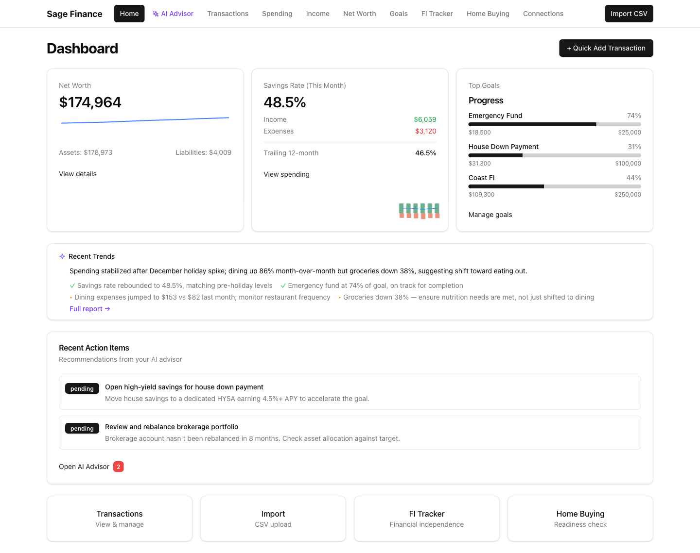
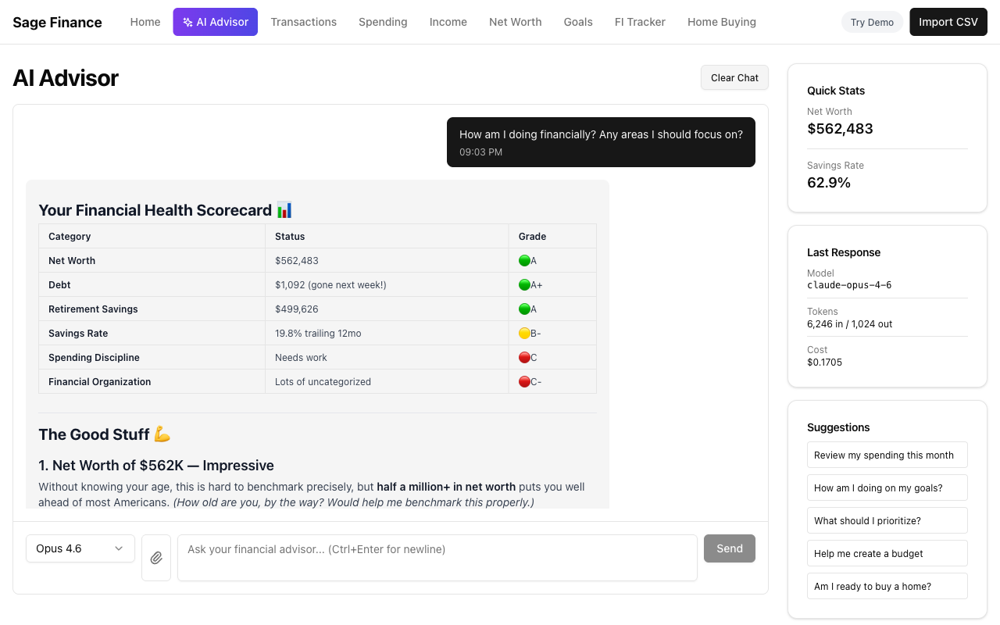
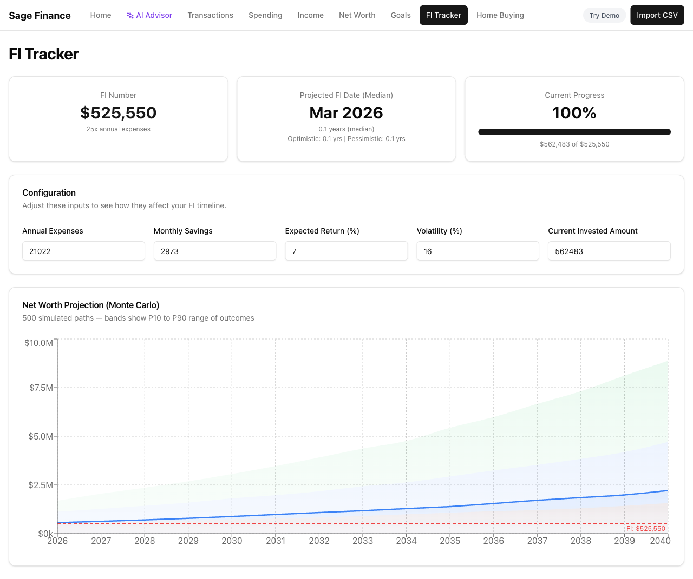
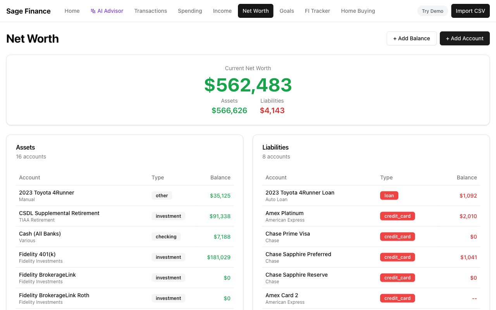

# Sage Finance

## RIP Mint. Long Live the Budget.

For years, Mint was the gold standard of personal finance apps. You connected your accounts, it categorized your spending, you felt vaguely responsible about money. It wasn't perfect — the auto-categorization was hit-or-miss, the "budgets" were more aspirational than actionable, and the ads were relentless — but it was *yours*. Then Intuit killed it.

The successors haven't filled the gap. Some are too simple. Some lock basic features behind paywalls. Most treat your financial data as the product, not you. And none of them are getting smarter.

So I built Sage Finance.



### What if your budget app actually understood you?

Sage Finance is a self-hosted personal finance dashboard that runs locally on your machine. Your data stays in a SQLite database on your disk. No cloud sync, no ads, no third-party analytics watching you agonize over your DoorDash spending.

But the interesting part isn't what it *doesn't* do — it's what it does.

**AI-powered financial advice.** Connect your Anthropic API key and Sage Finance gives you a personal financial advisor that actually knows your numbers. Not generic "spend less on lattes" advice — real analysis of your income, spending patterns, savings rate, and net worth trajectory. Ask it anything: "Am I saving enough?", "What would happen if I maxed out my 401k?", "Should I be worried about my spending this month?" It has the context to give you a real answer.



**AI document parsing.** Drop in a bank statement PDF or a brokerage CSV and the AI extracts and categorizes the transactions automatically. No more fiddling with column mappings or date format dropdowns.

**Monte Carlo FI projections.** Most financial independence calculators draw a single straight line into the future: "At 7% returns, you'll be FI in 14.3 years." That's a fantasy. Markets are volatile. You might get laid off. Your car might die. Sage Finance runs 500 simulated futures with realistic market volatility, expense shocks, income changes, and job loss risk, then shows you the full range of outcomes as a fan chart — from pessimistic (P10) to optimistic (P90). You don't get a single number; you get a probability distribution. Because that's what the future actually is.



**Smart auto-categorization.** Keyword-based matching learns your categories and gets transactions sorted without manual work. No machine learning training required — it just works out of the box and improves as you add categories.

### The full dashboard

- **Spending analysis** — category breakdowns, monthly trends, pie charts
- **Income tracking** — income sources over time
- **Net worth** — asset and liability tracking with historical charts
- **FI Tracker** — Monte Carlo projected path to financial independence
- **Goals** — savings goals with progress tracking
- **Home buying calculator** — affordability analysis with real numbers
- **CSV & PDF import** — bring your data from anywhere
- **AI Advisor** — ask questions about your finances in natural language




### The stack

- **Next.js 14** (App Router) + TypeScript
- **SQLite** via better-sqlite3 — zero-config, file-based, fast
- **Claude API** for AI advisor and document parsing
- **Recharts** for charts, **Tailwind CSS** + **shadcn/ui** for the interface
- **Papa Parse** for CSV ingestion

Everything runs locally. No Docker required. Just `npm install`, set your `ANTHROPIC_API_KEY`, and go.

## Getting Started

```bash
npm install
```

Set your Anthropic API key for AI features:

```bash
export ANTHROPIC_API_KEY=your-key-here
```

Run the development server:

```bash
npm run dev
```

Open [http://localhost:3000](http://localhost:3000) and start importing your financial data.

The SQLite database is auto-created in the `data/` directory on first use. No setup required.
